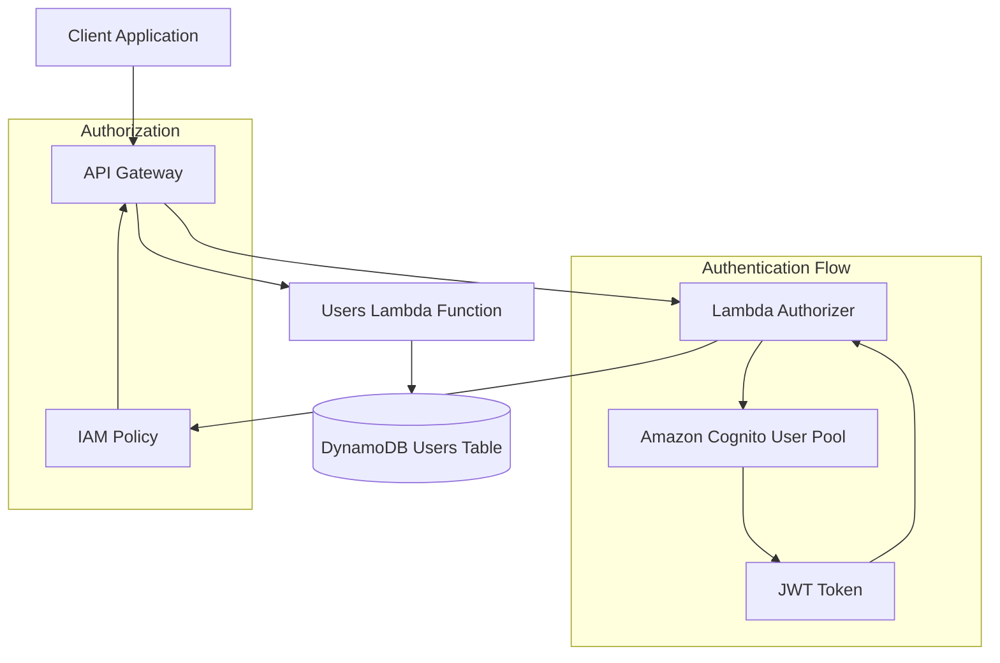
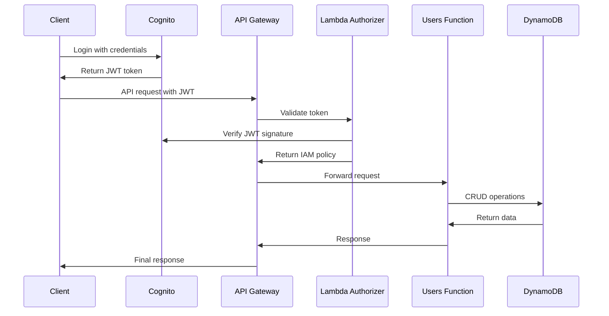

# Serverless Users API

A serverless REST API for user management built with AWS SAM, featuring JWT authentication via Amazon Cognito and role-based access control.

## Architecture Overview



## System Components

### Core Services
- **API Gateway**: RESTful API endpoint with JWT authorization
- **Lambda Functions**: 
  - Users handler for CRUD operations
  - Custom authorizer for JWT validation
- **DynamoDB**: NoSQL database for user data storage
- **Amazon Cognito**: User authentication and JWT token management

### Authentication & Authorization Flow



## API Endpoints

| Method | Endpoint | Description | Access Level |
|--------|----------|-------------|--------------|
| GET | `/users` | List all users | Admin only |
| PUT | `/users` | Create new user | Admin only |
| GET | `/users/{userid}` | Get user by ID | Owner or Admin |
| PUT | `/users/{userid}` | Update user | Owner or Admin |
| DELETE | `/users/{userid}` | Delete user | Owner or Admin |

## Project Structure

```
users/
├── src/api/
│   ├── users.py          # Main CRUD operations handler
│   └── authorizer.py     # JWT validation and authorization
├── events/               # Test event files
├── tests/
│   ├── unit/            # Unit tests
│   └── integration/     # Integration tests
├── template.yaml        # SAM template
├── requirements.txt     # Python dependencies
└── samconfig.toml      # SAM configuration
```

## Prerequisites

- AWS CLI configured
- AWS SAM CLI installed
- Python 3.10+
- Docker (for local testing)

## Deployment

1. **Build the application:**
   ```bash
   sam build
   ```

2. **Deploy to AWS:**
   ```bash
   sam deploy --guided
   ```

3. **Get deployment outputs:**
   ```bash
   aws cloudformation describe-stacks --stack-name ws-serverless-patterns --query 'Stacks[0].Outputs'
   ```

## Configuration

### Environment Variables
- `USERS_TABLE`: DynamoDB table name
- `USER_POOL_ID`: Cognito User Pool ID
- `APPLICATION_CLIENT_ID`: Cognito App Client ID
- `ADMIN_GROUP_NAME`: Admin group name (default: apiAdmins)

### User Groups
- **apiAdmins**: Full access to all user operations
- **Regular Users**: Access only to their own user data

## Authentication Setup

1. **Create a user in Cognito:**
   ```bash
   aws cognito-idp admin-create-user \
     --user-pool-id <USER_POOL_ID> \
     --username <username> \
     --user-attributes Name=email,Value=<email> \
     --temporary-password <temp-password>
   ```

2. **Get JWT token:**
   ```bash
   aws cognito-idp initiate-auth \
     --auth-flow USER_PASSWORD_AUTH \
     --client-id <CLIENT_ID> \
     --auth-parameters USERNAME=<username>,PASSWORD=<password> \
     --query 'AuthenticationResult.AccessToken' \
     --output text
   ```

## Usage Examples

### Create User (Admin only)
```bash
curl -X PUT https://<api-id>.execute-api.<region>.amazonaws.com/Prod/users \
  -H "Authorization: <jwt-token>" \
  -H "Content-Type: application/json" \
  -d '{"name": "John Doe", "email": "john@example.com"}'
```

### Get All Users (Admin only)
```bash
curl -X GET https://<api-id>.execute-api.<region>.amazonaws.com/Prod/users \
  -H "Authorization: <jwt-token>"
```

### Get User by ID
```bash
curl -X GET https://<api-id>.execute-api.<region>.amazonaws.com/Prod/users/<userid> \
  -H "Authorization: <jwt-token>"
```

## Security Features

- **JWT Token Validation**: Cryptographic signature verification
- **Role-Based Access Control**: Admin vs user permissions
- **Resource-Level Authorization**: Users can only access their own data
- **Token Expiration**: Automatic token expiry handling
- **CORS Support**: Cross-origin request handling

## Data Model

### User Object
```json
{
  "userid": "string (UUID)",
  "name": "string",
  "email": "string",
  "timestamp": "string (ISO 8601)"
}
```

## Testing

### Unit Tests
```bash
cd tests
pip install -r requirements.txt
python -m pytest unit/
```

### Integration Tests
```bash
python -m pytest integration/
```

### Local Testing
```bash
sam local start-api
```

## Monitoring & Observability

- **AWS X-Ray**: Distributed tracing enabled
- **CloudWatch Logs**: Function execution logs
- **CloudWatch Metrics**: API Gateway and Lambda metrics

## Cost Optimization

- **Pay-per-request DynamoDB**: No idle costs
- **Lambda**: Pay only for execution time
- **API Gateway**: Pay per API call
- **Cognito**: Free tier for up to 50,000 MAUs

## Cleanup

```bash
sam delete --stack-name ws-serverless-patterns
```

## Contributing

1. Fork the repository
2. Create a feature branch
3. Make changes and add tests
4. Submit a pull request

## License

MIT-0 - See LICENSE file for details